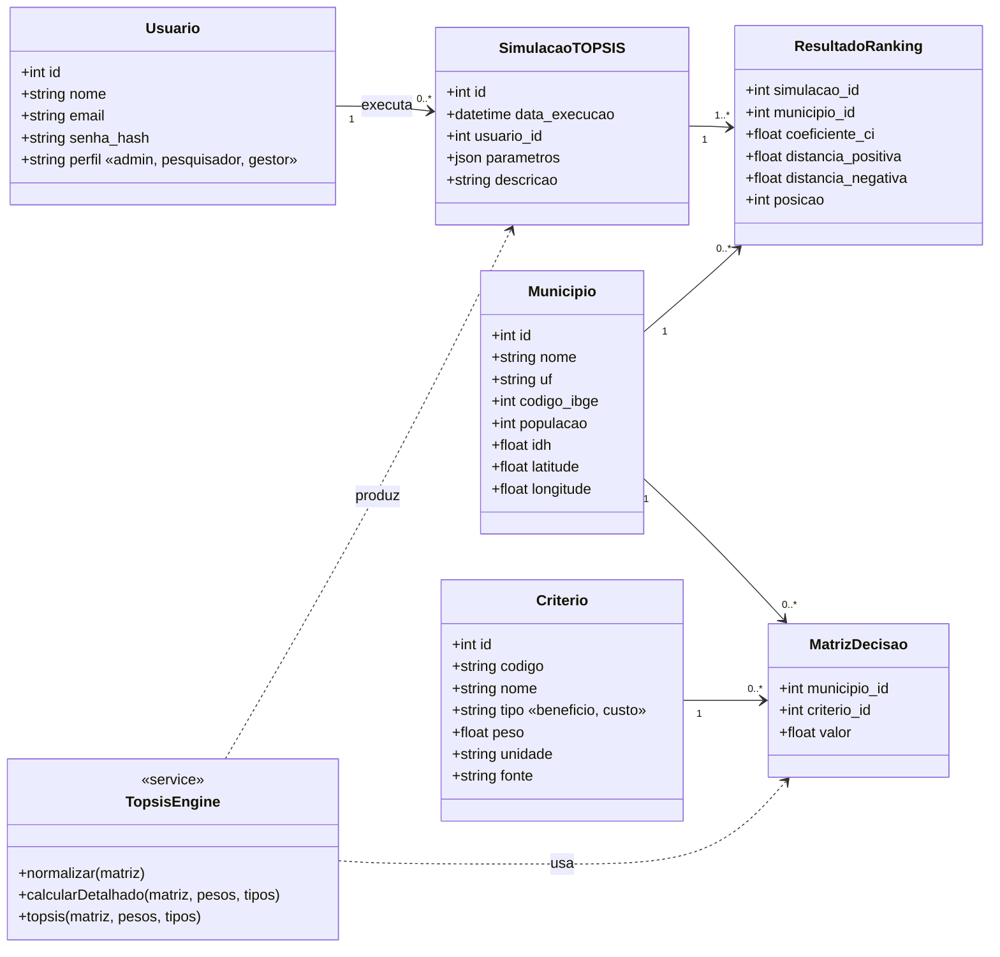
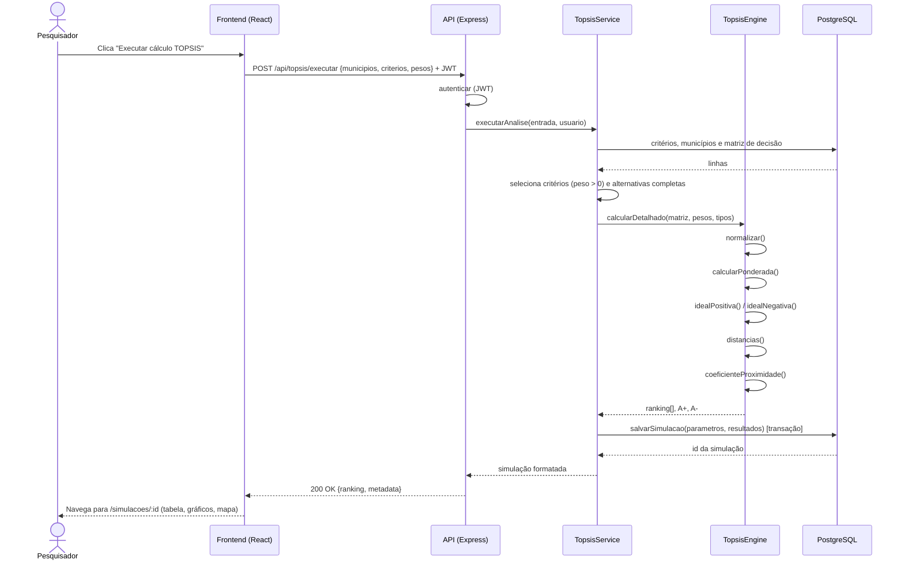
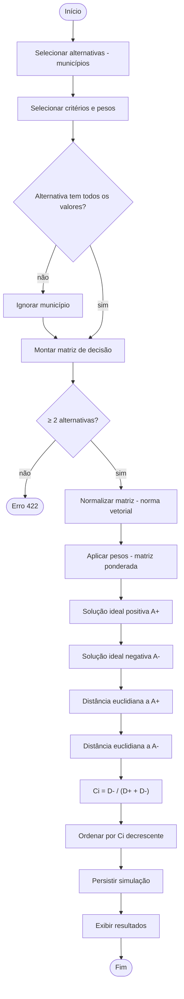
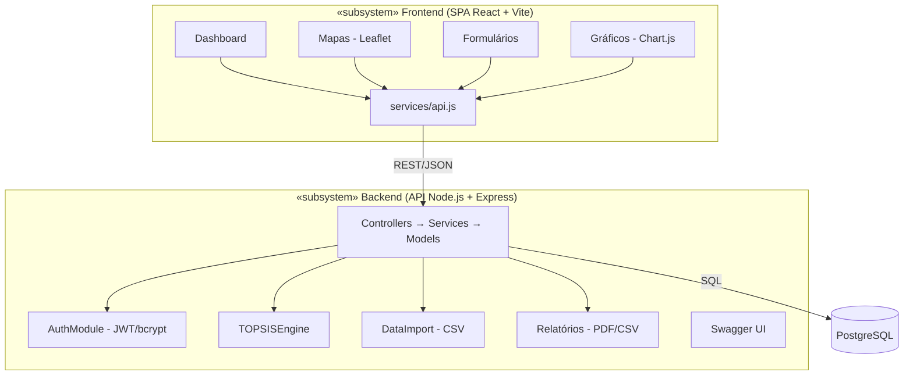
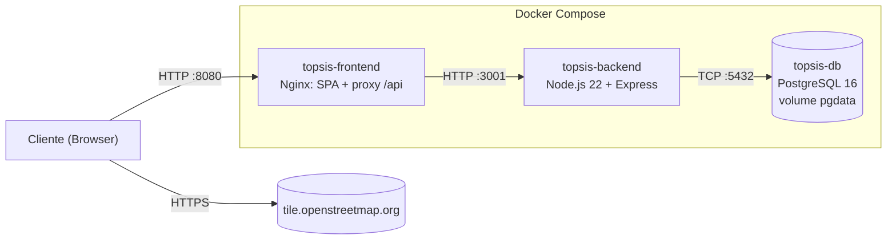
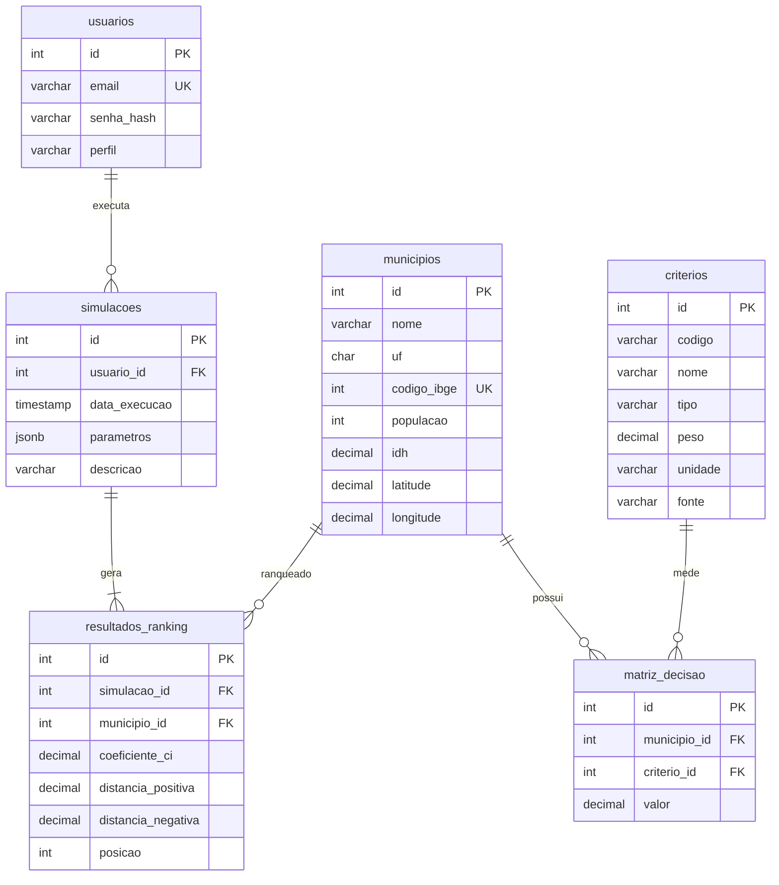

# Modelagem UML

> Capítulo 4 do roteiro. Os diagramas usam [Mermaid](https://mermaid.js.org/) e aparecem renderizados no GitHub e no VS Code.

### Especificação textual

**UC01 — Cadastrar município**
- **Ator:** Administrador (ou Pesquisador)
- **Pré-condição:** usuário autenticado
- **Fluxo principal:**
  1. O ator seleciona **Novo município**.
  2. O sistema exibe o formulário.
  3. O ator preenche os dados (nome, UF, código IBGE, população, IDH, coordenadas) e os indicadores C1…Cn.
  4. O sistema valida os dados no frontend e no backend e grava tudo numa transação.
  5. O sistema confirma o cadastro.
- **Fluxos alternativos:** dados inválidos → o sistema mostra o erro em cada campo (422); código IBGE duplicado → aviso de registro duplicado (409).

**UC02 — Configurar critérios TOPSIS**
- **Ator:** Pesquisador
- **Fluxo:** definir critérios (CRUD), tipo (benefício/custo) e pesos com sliders. O sistema exige soma = 1,0 e oferece **Normalizar** e **Pesos iguais**.

**UC03 — Executar TOPSIS**
- **Atores:** Pesquisador, Gestor
- **Fluxo:** selecionar o conjunto de dados (municípios) → ajustar critérios e pesos da execução → **Executar** → ver o ranking.
- **Alternativo:** menos de 2 municípios com dados completos → o sistema bloqueia e explica o motivo.

**UC04 — Gerar relatório**
- **Ator:** Gestor Público
- **Fluxo:** selecionar a simulação (Resultado ou Histórico) → exportar PDF ou CSV.

## 4.2 Diagrama de classes

## 4.3 Diagrama de sequência — Executar TOPSIS

## 4.4 Diagrama de atividades — fluxo TOPSIS

## 4.5 Diagrama de componentes

## 4.6 Diagrama de implantação

## Modelo do banco (ER)

